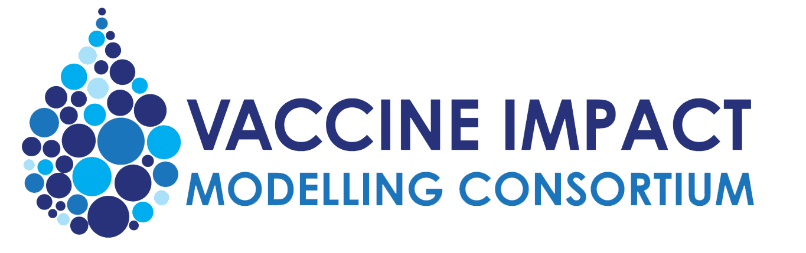

## Editing the content of the landing page

Edit the [`index.md`](index.md) file. You can write in either markdown or HTML.

## Editing the content of any page EXCEPT the Model and Disease pages

Look at the URL to find the name of the page - that name will match the name of the file that creates the page. For example, [`objectives.md`](objectives.md) creates `http://www.vaccineimpact.org/objectives`, [`reports.md`](reports.md) creates `http://www.vaccineimpact.org/reports`. Once you find the file that creates the file, edit that file - it can accept either markdown or HTML.

## Adding/modifying a model or disease page

All the model pages are under the [`models/`](./models/) folder and the disease pages are under the [`diseases/`](./diseases/) folder. Again, markdown or HTML is accepted.

## Adding to/modifying the various lists of people or the publications list

All sorts of "lists" are defined in the [`_data/`](./_data/) folder. Edit the corresponding YAML file under the [`_data/`](./_data/) folder and follow the same format as the other items in the file.

For example, to add a publication, edit [`_data/publications.yml`](./_data/publications.yml), find the section for the disease you want to add a publication to, and add the author, year, title and other pieces of information similarly to what you see there. Another example: to add a person to the Management Group list, edit [`_data/management-group.yml`](./_data/management-group.yml) and add another item with name, url, title, etc.

All images of people should be uploaded to `img/people`. If someone doesn't have an image, we have a placeholder image at `img/people/placeholder.png`.

## Adding new pages

To add a new page at the URL `http://www.vaccineimpact.org/example`:

- Add a file named `example.md` to the root directory of this repo
- The file **must** begin with two lines of three dashes (aka YAML front matter) in order for this new page to use the template. In other words, each file must begin with the following two lines

    ```
    ---
    ---
    ```
- You can write either in markdown or in pure HTML
- If you want to add images, I suggest you place all the images inside the [`img`](./img) folder and refer to images from there.
- In between the YAML front matter (between the two lines of dashes), you can specify a few parameters:
  - `title`: Gives a nice big title to the page
  - `subtitle`: A subtitle to the page
  - `bigimg`: The path to an image that will be used as a big wide "header image". This path has to point to a local file in this repository, it cannot point to an image on the web

## Modifying site-wide config settings

Such as: the number of news items to show on the landing page (currently set to 3), the Twitter handle to show on the landing page, the title of the website in the browser tab, Google Analytics ID, pages to show in the navigation bar.

Edit the [`_config.yml`](_config.yml) file.

## How to add news items

Any page you create inside the `_posts` folder will be treated as a blog post aka news entry. The nice thing about blog post-type pages is that they will automatically be shown chronologically at `http://www.vaccineimpact.org/news`, with all the pagination to previous/next news taken care of.

Posts are created in exactly the same way as regular pages: you still need to make them `.md` file, they have to have YAML front matter, they can support the `title`/`subtitle`/`bigimg` parameters, you can add lists into them, etc. The only difference is that the name of the file must begin with the date of the post. For example, `2016-08-20-some-news.md`. It's vital that the name of each post contain the date in such a format, followed by whatever name you want, followed by `.md`.

## How to edit the style of the website

The general layout of the pages can't be changed easily.  But things like colour, spacing, fonts, and any other CSS style can easily be changed by adding CSS rules to the [`vimc.css`](./css/vimc.css) file. For example, you can change the size of the text, or the background colour of the navigation bar, or the colour of the text in the footer.

Note that the template was designed in a way such that it changes drastically when you view it on a big screen (laptop) vs a small screen (phone)
